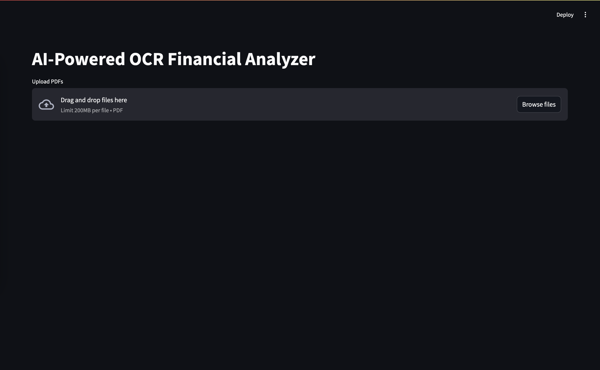
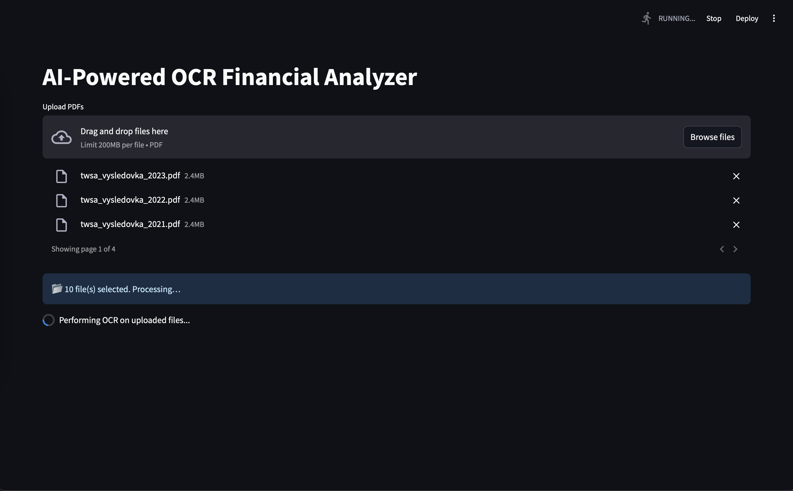
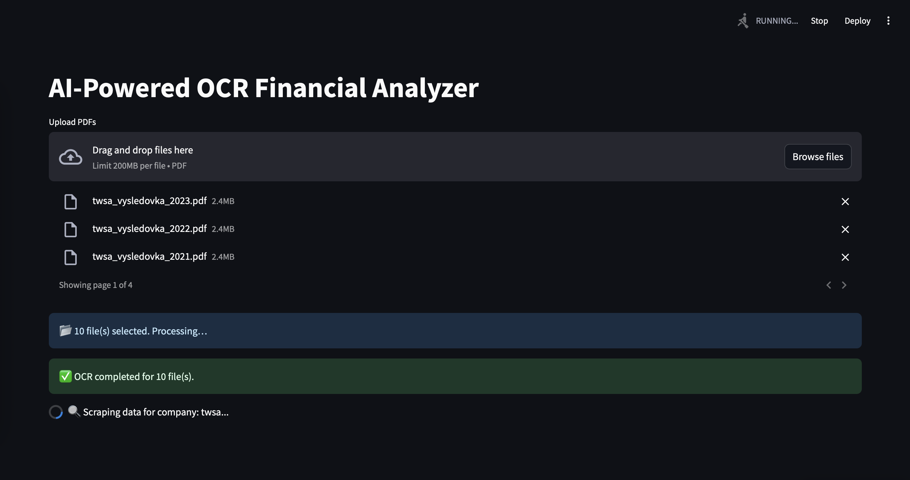
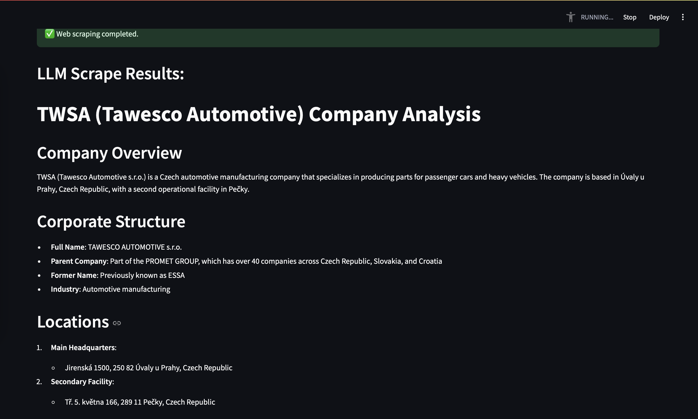
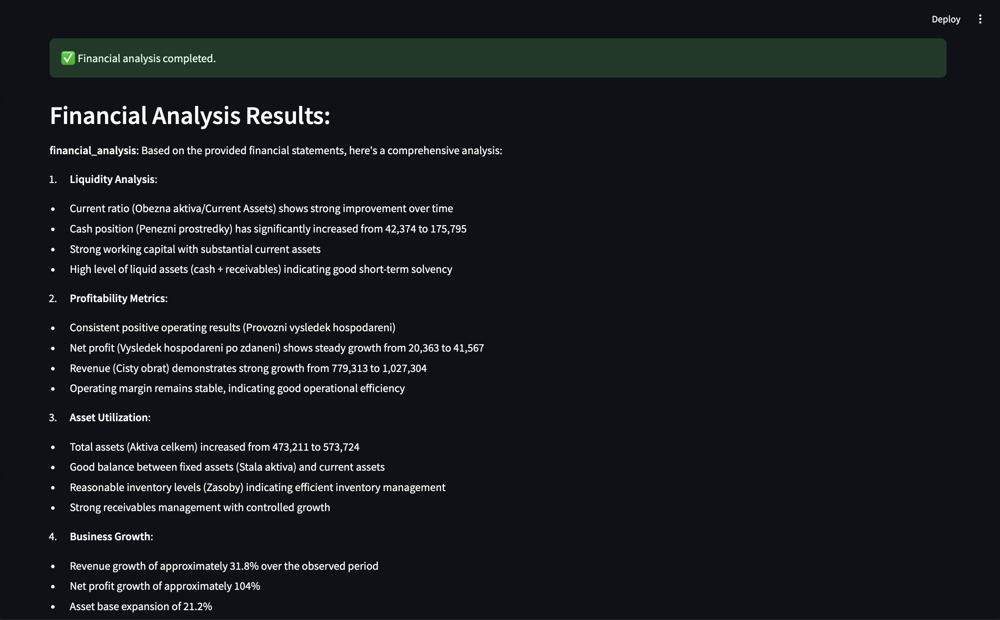

# Deepnote Hackathon Project - AI-Powered OCR Financial Analyzer for Czech Companies

[](https://github.com/petr-ngn/deepnote-hackathon/actions/workflows/pylint.yml)


**Team**: [Petr Nguyen](https://www.linkedin.com/in/petr-ngn/) (Main Developer), [Samuel Kruzek](https://www.linkedin.com/in/samuel-krúžek-63882b226/), [Simona Dohova](https://www.linkedin.com/in/simona-dohová-182427153/)

**Result**: 1st Place + 2,000 USD Prize Money + 30,000 USD DeepNote Credits
## Overview
This project leverages a finetuned AWS OCR model to extract financial data from scanned PDFs, a web scraping LLM to gather supplementary company information, and a financial analysis LLM to evaluate liquidity, profitability, and debt. The combined analysis helps determine if a company is likely to pay invoices on time.


## Features
- **OCR Processing:**  
  Extracts key financial metrics from balance sheets ("rozvaha") and P&L statements ("vysledovka") using AWS Textract with custom queries. Noted, it was fine-tuned on Czech companies financial statements only!
- **LLM Integration:**  
  Utilizing Amazong Bedrock and their LLM's to perform prompt engineering, tool use, function calling, summarization, etc.
- **Web Scraping with Tavily API:**  
  Search engine specializing to enhance AI apps. Output of Tavily search is futher enhanced by Anthropic Claude 3.5/3.7 Sonnet to provide a comprehensive overview of the company.
- **Financial Analysis:**  
  Using Anthropic Claude 3.5/3.7 Sonnet to assess financial health and generate recommendations.
- **AWS S3 Integration:**  
  Stores input files and raw analysis results in an S3 bucket.
- **Interactive Interface:**  
  Built with Streamlit, featuring file upload, spinners for processing states, and a summary table displaying key financial metrics.
- **Deepnote Deployment:**
  All of these were then packaged and deployed into DeepNote environment, up and running!

## Next steps
- Large scale fine-tuning with more training and annotated data for more accurate and robust results.
- Expansion to other languages and different financial documents (cash flow, annual reports, ...).
- Expansion to multi-lingual documents (not only restricted to Czech companies).
- Expansion to other financial statements' fields to extract more crucial and relevant data and get more contexts for LLM's.
- Utilize multi-agent AI architectures in order to be able to provide more complex and comprehensive analysis.
- Document classification tool (into balance sheets and P&L statements) - currently based on PDF file names.
- Provide user with additional Macroeconomic data and insight about the industry.
- Asynchronous workflows.
- Add logging.

## Local set up
Clone the repository:
```bash
git clone git@github.com:petr-ngn/deepnote-hackathon.git
cd deepnote-hackathon
```
Fill out your credentials into your `.env` file (AWS access/secret credentials, Tavily API key, S3 bucket name, Textract adapter ID's).
```bash
AWS_ACCESS_KEY_ID=XXX
AWS_SECRET_ACCESS_KEY=XXX
AWS_REGION=XX

TAVILY_API_KEY=XXX

S3_BUCKET_NAME=XXX
TEXTRACT_ADAPTER_BALANCE_SHEET_ID=XXX
TEXTRACT_ADAPTER_PROFIT_LOSS_ID=XXX
```
Install Poetry and run the app locally:
```bash
curl -sSL https://install.python-poetry.org | python3 -
export PATH="$HOME/.local/bin:$PATH"

poetry install --no-root
source $(poetry env info --path)/bin/activate
poetry run streamlit run app.py
```

Or just build Docker image and then run the app Docker container locally:

```bash
docker build -t deepnote-hackathon .
docker run -p 8501:8501 --env-file .env deepnote-hackathon:latest
```

Optionally, you can run Pylint to see the quality of the written source codes:
```bash
poetry run pylint $(find src -type f -name "*.py")
```

### OCR demo
Unfortunately within those 24 hours we didn't manage to build a document type classification tool which would determine whether the uploaded PDF file is ether balance sheet or P&L statement, and also more proper OCR for extraction of company name and optionally a year of statement.

That's why we've decided to deal with such issues in the following way, as it was not possible to properly solve them within 24 hours:
-  each document has to folow this naming convention: `<company_name>_<document_type>_<year>.pdf`
  - e.g., `twsa_rozvaha_2020.pdf`, `twsa_balancesheet_2020.pdf`, or `twsa_vysledovka_2020.pdf`, `twsa_profitloss_2020.pdf`.

In `.pdf_examples/` directory are uploaded PDF examples of TWSA company where had been used during demo presentation, so feel free to use them too and uploaded them into our app!

App interface:
<p align="center">
   
</p>

PDF's upload and OCR:
<p align="center">
   
</p>


LLM-based web scraping:
<p align="center">
   
</p>
<p align="center">
   
</p>

LLM-based Financial Analysis utilizing both OCR results and web scraped results:
<p align="center">
   
</p>
