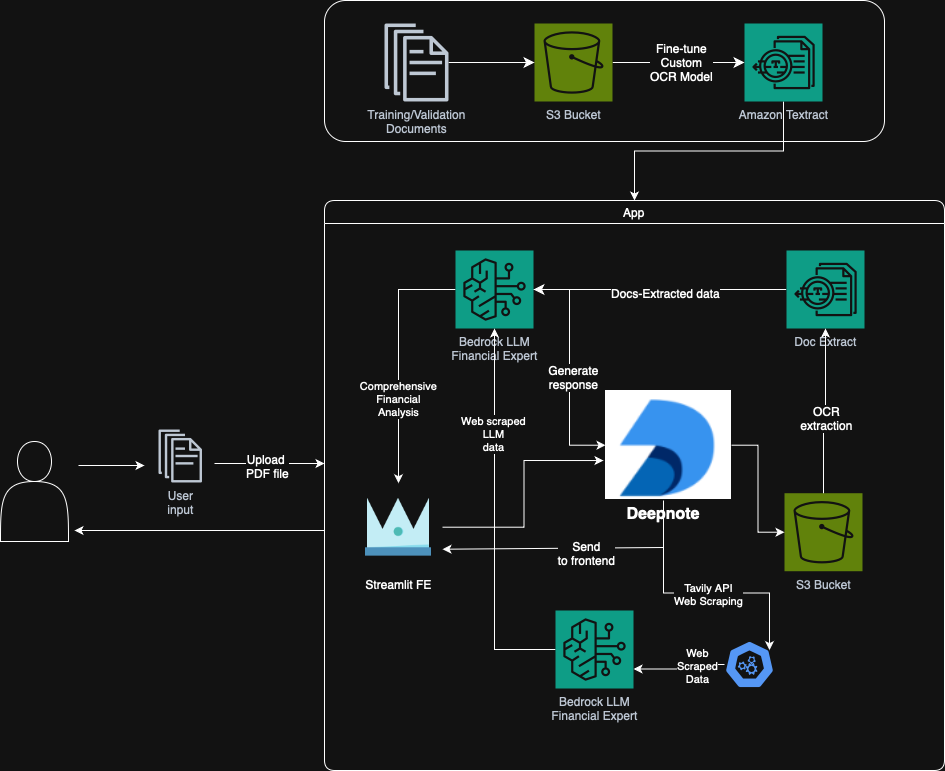

# Deepnote Hackhaton Project - AI-Powered OCR Financial Analyzer
**Team**: [Petr Nguyen](https://www.linkedin.com/in/petr-ngn/) (Main Developer), [Samuel Kruzek](https://www.linkedin.com/in/samuel-krúžek-63882b226/), [Simona Dohova](https://www.linkedin.com/in/simona-dohová-182427153/)

**Result**: 1st Place + 2,000 USD Prize Money + 30,000 USD DeepNote Credits
## Overview
This project leverages a finetuned AWS OCR model to extract financial data from scanned PDFs, a web scraping LLM to gather supplementary company information, and a financial analysis LLM to evaluate liquidity, profitability, and debt. The combined analysis helps determine if a company is likely to pay invoices on time.



## Features
- **OCR Processing:**  
  Extracts key financial metrics from balance sheets ("rozvaha") and income statements ("vysledovka") using AWS Textract with custom queries.
- **LLM Integration:**  
  Utilizing Amazong Bedrock to perform prompt engineering, tool use, function calling, summarization, etc.
- **Web Scraping with Tavily API:**  
  Is a search engine specializing to enhance AI apps. Output of Tavily search is futher enhanced by Anthropic Claude Sonnet to provide a comprehensive overview of the company.
- **Financial Analysis:**  
  Using Anthropic Claude Sonnet to assess financial health and generate recommendations.
- **AWS S3 Integration:**  
  Stores input files and raw analysis results in an S3 bucket.
- **Interactive Interface:**  
  Built with Streamlit, featuring file upload, spinners for processing states, and a summary table displaying key financial metrics.

## Next steps
- Large scale finetuning with more training and annotated data for more accurate and robust results.
- Expansion to other languages and different financial documents (cash flow, annual reports, ...).
- Utilize multi-agent AI architectures in order to be able to provide more complex and comprehensive analysis.
- Document classification (currently based on "regex" of PDF file names).
- Provide user with additional Macroeconomic data and insight about the industry.
- Asynchronous workflows.

## Set up
```bash
poetry install --no-root
```

```bash
poetry run streamlit run app.py
```


